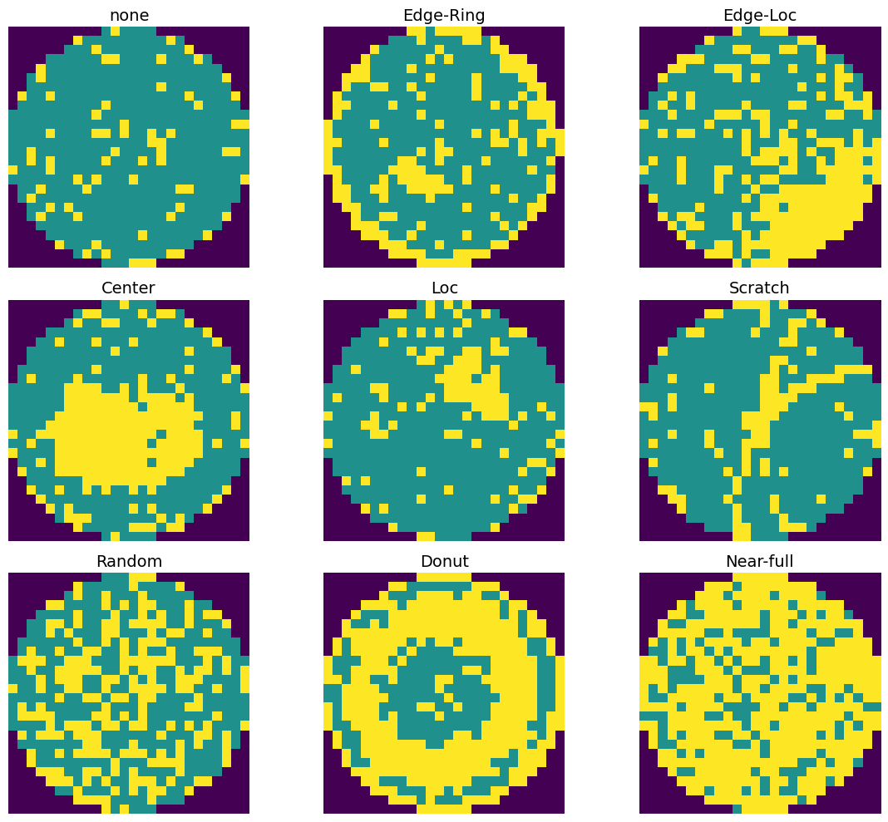
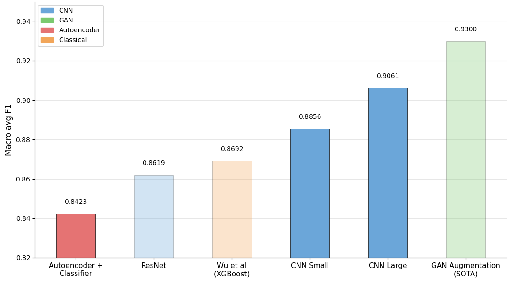

# Wafer Defect Pattern Classification

In this project, we trained and evaluated various machine learning models to classify defect patterns on semiconductor wafers.

**Interactive Wafer Defect Classifier**
- Live Demo: [https://waferdefects.vercel.app/](https://waferdefects.vercel.app/) 
- Github [https://github.com/Shanthanu-g/waferanalyzer](https://github.com/Shanthanu-g/waferanalyzer)


## Dataset

We used the [WM-811K Wafer Map](https://www.kaggle.com/datasets/qingyi/wm811k-wafer-map) dataset for this project

- 811,457 wafer samples from real fabs (172,950 labeled, 638,507 unlabeled)
- Each wafer is a 2-D matrix
(0: outside, 1: good, 2: defective)
- 9 classes:
`None`, `Edge-Ring`, `Edge-Loc`, `Center`, `Loc`, `Scratch`, `Random`, `Donut`, `Near-Full`



### Download

All notebooks have a cell that downloads the dataset and caches it to your computer but if that does not work:
   - Download dataset from Kaggle
   - Set the `file_path=` in the notebook to where the dataset is downloaded.

## Setup

### Step 1 - Install Dependencies

#### Option A: using uv package manager (recommended)

```bash
# Install uv
curl -LsSf https://astral.sh/uv/install.sh | sh

# Install all dependencies and launch Jupyter
uv sync --dev
uv run jupyter notebook
```

#### Option B: using pip

```bash
python -m venv .venv
```

```bash
# macOS/Linux
source .venv/bin/activate

# Windows
.venv\Scripts\activate
```

```bash
pip install -r requirements.txt
```

### Step 3: Register a kernel

```bash
# If using uv
uv run ipython kernel install --user --name=cmpe257-s26-wd
```

```bash
python -m ipykernel install --user --name=cmpe257-s26-wd --display-name "cmpe257-s26-wd"
```

### Step 4 — Run Notebooks

```
uv run jupyter notebook
```


## Notebooks
1. `wafer_defects.ipynb` — Exploratory Data Analysis
2. `classical_ml.ipynb` — Classical ML experiments
3. `CNN.ipynb` — CNN experiments
4. `Autoencoders.ipynb` - Autoencoder experiment
4. `ResNet.ipynb` — ResNet experiment
5. `results.ipynb` — Compare trained models

## Results

| Model | Params | Lat. (ms) | Macro F1 |
|---|---|---|---|
| Baseline (Random Forest) | — | 0.5686 | 0.652 |
| Wu et al. (XGBoost) | — | 0.0338 | 0.869 |
| CNNSmall | 597K | 0.4589 | 0.886 |
| Autoencoder | 2.8M | 1.0828 | 0.842 |
| MobileNetV2 ✱ | 2.2M | — | 0.930 |
| **CNNLarge** | **2.4M** | **1.2167** | **0.906** |
| CNN + 58f (RF) | 2.4M | 1.2167 | 0.906 |
| ResNet-18 | 11.2M | 2.0200 | 0.862 |

✱ Literature SOTA; requires separate GAN pipeline



## Team Members

- Purav Parab
- Hossein Khoshnevis
- Sam Jafari
- Shanthanu Gopikrishnan